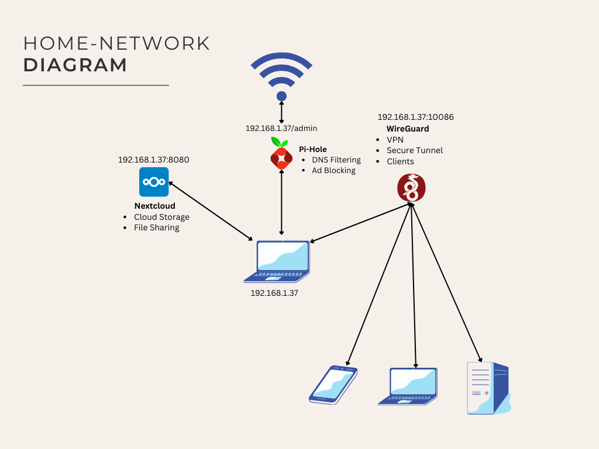
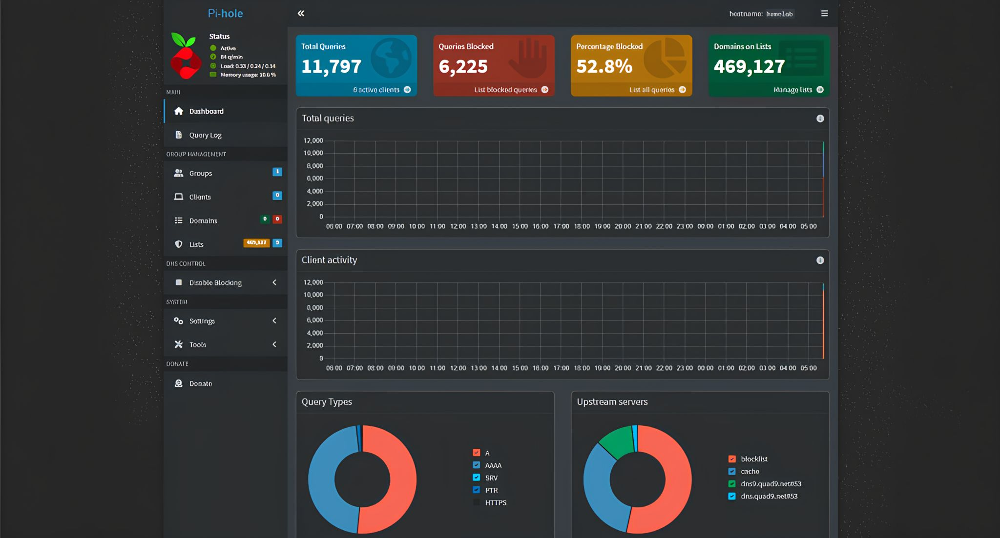
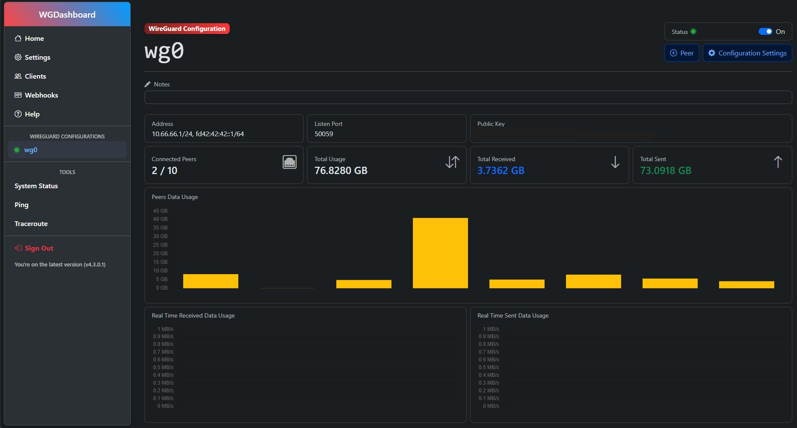
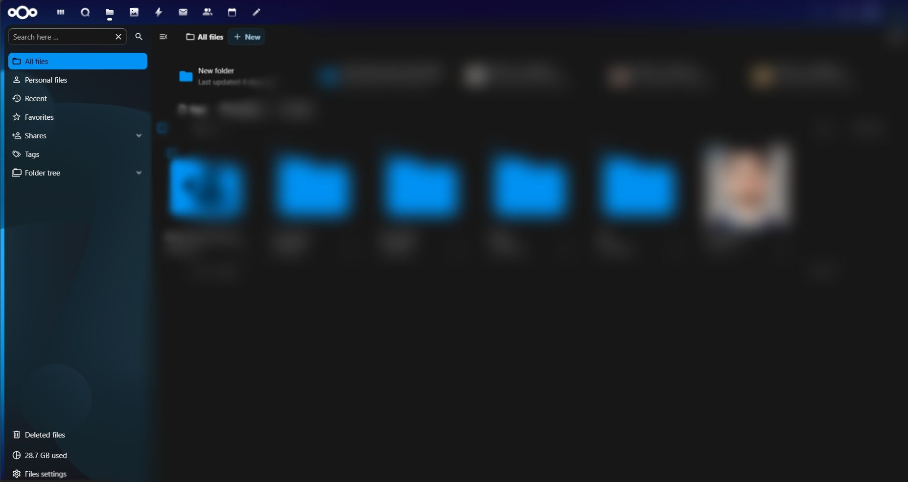

# Home-Network-Security-Lab-Nextcloud-Pi-hole-WireGuard
I recently repurposed an old laptop into a personal Network & Cloud Lab, combining Pi-hole, WireGuard, and Nextcloud to build a practical, security-focused home setup.

## This system now:
Filters DNS traffic for any device connected through my WireGuard VPN or devices on my LAN that I manually point to the Pi-hole DNS
Provides secure remote access through WireGuard
Hosts a private cloud using Nextcloud for file syncing and remote access

I also created a simple network diagram and captured dashboards from each service to show how everything integrates. Working on this project gave me hands-on experience with:
VPN configuration
DNS filtering and network-level visibility
Self-hosting and service hardening
Troubleshooting on limited hardware

Small personal projects like this are hugely valuable because they force you to actually build, break, and fix real systems, not just read about them.

